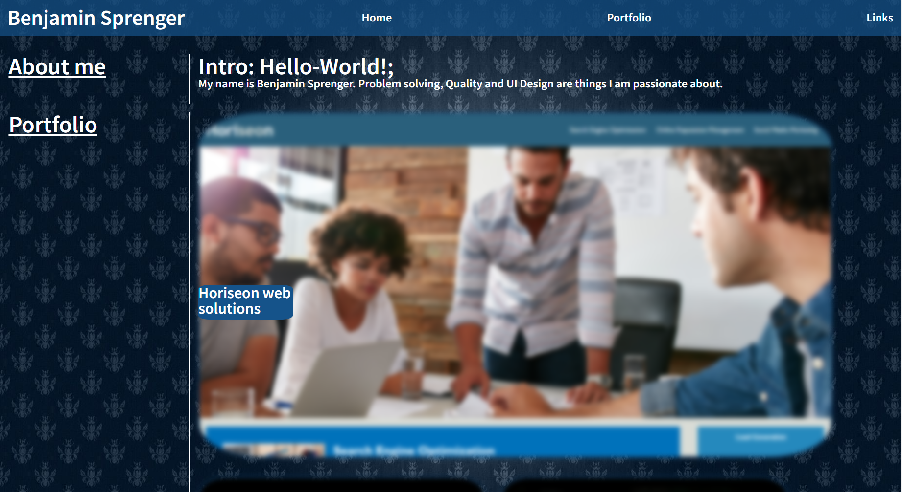

# Portfolio
## Benjamin Sprenger's Portfolio

In order to do well at job interviews, a portfolio is a great tool to showcase material that i've prepared and show a polished picture of me and my skills.

## Visit the Website!
[Click me!](https://azrazel95.github.io/leafcarrier/)

## Contributing

Please do not contribute.

## License
This project has been licensed under the MIT license
---
© benjamin sprenger 